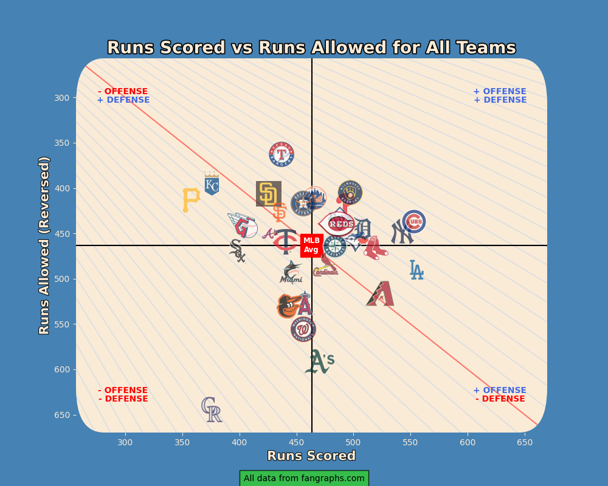

# Baseball Chart Explainer  
  
## Table of Contents  
- [Battter wRC+ Chart](#batterwrcchart)  
- [Pitcher WAR Chart](#pitcherwarchart)  
- [Graphical Standings Chart](#graphicalstandingschart)  
- [Rolling Run Differential Chart](#rollingrundiffchart)  
- [Total Run Differential Chart](#totalrundiffchart)  

## Batter wRC+ Chart  
  
 

This purpose of this chart is to show the distribution of wRC+ for every player in the 
league, highlighting players from a specific team, and then for those players display 
some additional metrics in an accompanying table. 

**wRC+**, or Weighted Runs Created+, is an offensive metric designed to capture all of
the offensive value created by a batter, scaled in such a way that a wRC+ of 100 is the
league average, a wRC+ of 110 would be 10% better than average, and a wRC+ of 90 would
be 10% lower than average.

For a full explainer of the metric, and how it is calculated, see the [glossary page on Fangraphs](https://library.fangraphs.com/offense/wrc/).

This chart display a swarm plot of every qualified batter in the league in pale grey,
so that the viewer can see where a certain value fits in the grander league context.
For example, we can see that there is exactly one player in this chart with a wRC+ 
greater than 200, indicating that they created twice the offensive value of an average
MLB batter.

Against this league distribution, batters from an individual team, in this case the 
Toronto Blue Jays, are highlighted. This is so we can see how batters from that team 
compare to the rest of the league. These highlighted points are labelled with the 
player's name and wRC+ value.

If you're wondering why a certain player from your favorite team isn't appearing in 
these plots, note the subtitle. A minimum qualified number of at-bats is used to
filter out players putting up extreme results in small samples, and from the remaining
batters, the top-12 by total at-bats for each team are highlighted.

In addition to the swarm plot, there is a corresponding table displaying additional 
metrics for each of the highlighted players to provide more context for their season.

Also included in this chart is the rank of the team as a whole. In this example, we see that the Jays
have a wRC+ of 109 as a team, which ranks them 6th in the league.

## Pitcher WAR Chart 

 

This chart is very similar in format to the batter wRC+ chart. The purpose of this one is to evaluate both the starting and relief pitchers for a given team against the rest of the league, this timeusing WAR as the metric of choice.

**WAR**, or Wins Above Replacement, is a metric designed to capture all of the value provided by a player
relative to a theoretical 'replacement player'. The idea of a replacement player is a player that any
team can call up from AAA for spot duty, i.e. the kind of player that every team has access to. So a 
player that has a Wins Above Replacement of 4.0 has provided 4 wins worth of value more than a 
typical replacement player. A more thorough explanation and methodology can again be 
[found on Fangraphs](https://library.fangraphs.com/misc/war/).

One key difference between this plot and the batter plot, in addition to the metric being analysed, is
that we are looking at two distinct categories of pitchers here: starters and relievers. The value 
expected from these positions differs quite a bit, so instead of combining them in one bucket, they
are displayed seperately in this plot with the scatter points for starters being a darker shade than
those of relievers. From this we can see that the distribution of WAR provided by starters is much 
wider than that of relievers, with a much higher ceiling (which makes sense due to the vast difference
in workloads, as WAR is a cumulative stat.)

Thus included in the scatter plot are two lines denoting league averages, one for starters and one for
relievers. This is useful for comparing the highlighted players to the averages for their specific 
position. 

In this chart, the top-5 starters and top-7 relievers by innings pitched are highlighted for each team.

The corresponding table for this plot shows innings pitched and ERA, as well as K-BB% and Stuff%.

**K-BB%** is simply a pitchers Strikeout% minus their Walk%. This is a single metric that has been shown
to be especially predictive of future ERA, which is pretty intuitive as pitchers who are striking out a 
lot more batters then they are walking will clearly be dealing with less traffic on the base paths, and
strikeouts/walks aren't influenced by the defence playing behind a pitcher so it's a better indicator of
their own individual performance compared to something like ERA.

**Stuff+** is another advanced metric that aims to capture how nasty a pitcher's pitches are, both on an
individual basis and how they play off each other. Like wRC+, it is scaled in such a way that a Stuff+
of 100 would be league average, 110 is 10% better than league average, etc. Once again, if you're looking
for a more thorough explanation, [Fangraphs is an excellent resource](https://library.fangraphs.com/pitching/stuff-location-and-pitching-primer/).

## Graphical Standings Chart 

 

The purpose of this chart is to display the standings for each division in a way that shows the journey
they have been on throughout the season.

The y-axis shows how many games above/below .500 each team is, and the x-axis shows the game number for
each point in time. 

In the example below, which shows this plot for the National League Central, we can see the Pittsburgh 
Pirates are at the bottom of the divisional standings, and the have been below 0.500 since the begining
of the season. 

Conversely, we can see the Brewers at the top of the standings (they are actually tied
with the Cubs, whose logo is being hidden by that of the Brewers). At the time of this writing, the
Brewers are actually in the midst of a long winning streak, which can be seen here since the navy line
corresponding the Brewers has not gone down since game ~91.

Finally, we can also see that the Reds and the Cardinals have been mostly neck-and-neck slightly above 
.500 for most of the season.

## Rolling Run Differential Chart 

 

This chart is an animated one that shows, for each team in a given division, the 20-game rolling
average for their run differential over their last 50 games.

The purpose of this chart is to show how the performance of each team has been trending recently, with
run differential being used as a proxy for performance (the idea here being that teams which are 
performing well recently will have a better recent run differential than teams performing badly).

A rolling average simply means that we are plotting a team's average run differential in 20-game 
segments. In the example below, the most recent game for most teams is team 106, so the values you
see plotted are their averages for games 86-106, games 85-105, games 84-104, etc. This provides a
better indicator for how a team is performing recently then just looking at their full-season 
run differentials, and also produces a smoother line.

So in this example, we can see that the Marlins have been playing quite well over their last 
30ish games, the Mets have been a bit of a roller coaster, the Phillies starting a bit slow but
turning it on recently, and the Braves and Nationals trending steadily downwards.

## Total Run Differential Chart  

 

This chart shows the runs scored plotted against the runs allowed for every team in the league, through
the entire season. The goal of this is to compare teams run differentials against each other, and also
show if they're arriving at that run differential primarily with run scoring, run prevention, or both.

The x-axis here shows runs scored, so that teams on the right side of that chart are scoring more
than teams on the left. The y-axis shows runs allowed but inverted, so that teams at the top prevent
more runs than teams at the bottom. 

Thus, the best all-around teams will be those in the top-right quadrant, with the team furthest to the
top-right being the team with the best total run differential (in this case, the Cubs). The grey diagonal
lines in this plot are present to make it easier to compare teams on this axis. In the opposite situation are the Rockies, who are by far the worst team in the league by run differential.

From here, we can also clearly see that the Texas Rangers are the best team in the league when it comes to run prevention, and the Cubs and Dodgers are neck-and-neck for the best offense.

The big red diagonal line is meant to indicate the break-even point, so that every team above the line 
has a positive run differential, and every team below is in the negative.

